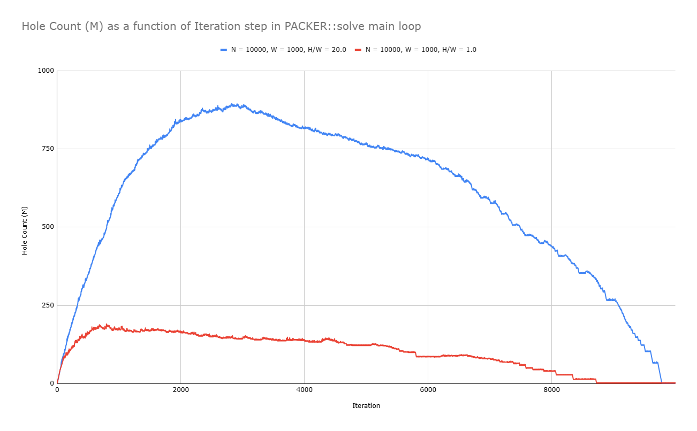

## Strip Packing C++ Rewritten

### Description
This repository contains an implementation for the strip packing problem that can be found here: https://en.wikipedia.org/wiki/Strip_packing_problem

Our goal is to optimize the placing of rectangles in a strip of fixed width (W) and variable height, such that the overall final height of the strip is minimal.
This is an NP-hard optimization problem.

In this particular implementation, we keep our focus on the empty spaces in the strip or the "holes" instead of keeping track of the rectangles per se. The first hole starts as the whole infinite strip of size (W, ∞). As we place a rectangle at the top left or top right of the hole, we break that hole into new holes, and resolve any overlaps with other holes, making sure that the holes we keep are maximal. We can also allow the rotation of rectangles. We can specify the width of the strip, specify the initial sorting strategy for the rectangles, verbosity, output file, etc...

### Setup (for users wanting to use the graphical interface)
- Linux users follow [Linux SFML Installation Guide](https://www.sfml-dev.org/tutorials/3.0/getting-started/linux/)
- Mac users follow [macOS SFML Installation Guide](https://www.sfml-dev.org/tutorials/3.0/getting-started/macos/)
- Windows users need to setup [MSYS2](https://www.msys2.org/), run `pacman -Ss SFML` and find the appropriate SFML package, and install it using `pacman -S <target_package>`

### Building
```bash
git clone 
cd ./strip-packing-cpp-rewritten/

make # optimized compilation (default)
# make debug # debug compilation
# make release # static release compilation

cd build

# ready to pack rectangles, run each executable to see instructions
ls
```

### Input File Format
```
<rectangle 1 width: int> <rectangle 1 height: int>
<rectangle 2 width: int> <rectangle 2 height: int>
...
```

### Testing
- You can make your own test instances using the `generate` executable. Run it to see usage instructions.<br>`generate` works by taking your input width (W), height-to-width ratio (r = H/W), converting it to a rectangle with dimensions (W, W * r), and recursively splitting this rectangle into smaller rectangles until reaching the rectangle count of N that you specified.
- You can run a multitude of tests and generate a comprehensive output file using the `bench` executable.
- If you want, you can use famous [instances](./instances_no_rotation/) in the research community of strip-packing. Keep in mind these instance files are extremely hard to find and might be incorrect because there are no agreed upon instances used for strip-packing and no attempt at standardizing testing practices has been made. Consequently, many instances aren't correct or the results obtained with them don't line up or make sense with results showed in other papers.

## Results
3D graph made using Plotly showing the evolution of the worst-case optimality (α = H/OPT(I)) of the algorithm as the number of rectangles (N) goes to ∞ and the length of the optimal solution compared to strip width changes. <br>Methodology: ran 2000 iterations per N and H/W configuration using `bench` binary, results found in the [runs](./runs/) folder.


## Algorithm Analysis $\rightarrow$ $O(N^3)$ Time, $O(N)$ Space
Studied function: [PACKER::solve](./src/packer/packer.cpp#716), packer.cpp:716

### <u>Time</u>

##### Initialization
Creating `RESULT` object, holes set, initial hole: $O(1)$

##### Sorting
Sort rectangles using `std::sort`, comparators perform a constant number of comparisons: <b>`O(N log N)`</b>

##### Main Loop
The function iterates $N$ times (once per rectangle). The cost of each iteration is dominated by `updateHoles`:
*   `getBestHole`: Iterates through all $M$ holes -> $O(M)$
*   `fewNeighborsOnLeft`: Iterates through all $N$ rectangles -> $O(N)$
*   `updateHoles`: This is the bottleneck. It has a nested loop structure, first looping through all holes, and checking for covered holes, resulting in $O(M^2)$.
*   **Total per iteration:** $O(N + M^2)$

##### Growth of M (Number of Holes)
The number of available holes $M$ grows at most linearly with the number of rectangles placed $N$. Therefore, we can consider $M$ to be $O(N)$.
The chart below shows the evolution of $M$ as we iterate through the Main Loop. $O(N)$ is going to be a strict upper bound for M.


##### Finalization & Validation
*   Deleting remaining holes: $O(M) = O(N)$
*   The optional validation check (`#if CHECK_VALID`) uses a nested loop over all rectangles: $O(N^2)$

##### Overall Time Complexity
The total time is $O(N*log(N))$ + sum from $i = 1$ to $N$ of $O(N + i^2)$. The sum evaluates to $O(N^3)$. This term dominates all others.<br>
Final Time Complexity: $O(N^3)$

### <u>Space</u>

##### Input Data
The `rectangles` vector stores $N$ pointers: $O(N)$

##### Main Data Structures
The `holes` set is the primary auxiliary data structure. It stores $M$ pointers to dynamically allocated `SHAPE` objects. Since $M = O(N)$, this requires $O(N)$ space.

##### Temporary Data Structures
Inside `updateHoles`, the temporary `newHoles` set also stores up to $M = O(N)$ elements, but this does not increase the overall peak memory usage.

##### Overall Space Complexity

The peak memory usage is dictated by the size of the `holes` set.<br>
Final Space Complexity: $O(N)$